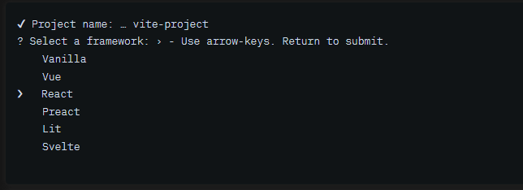
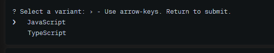
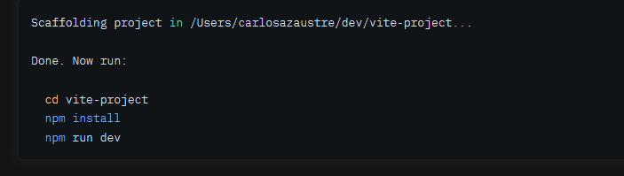
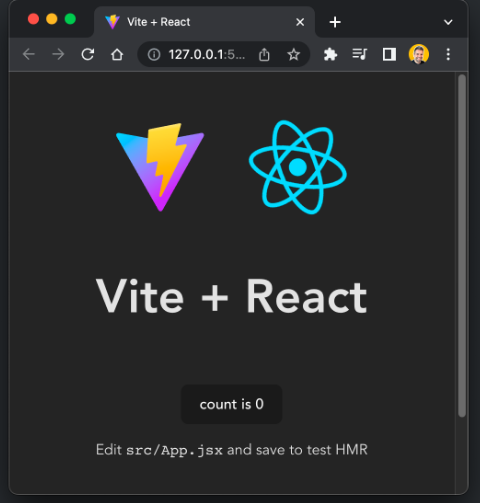

El presente proyecto tiene como primer objetivo el desarrollo del frontEnd en la React 
donde se utilizara las siguientes :
# React + Vite

1-. React +Vite 
1.  instalacion: npm create vite@lastest

seguir los paso de instalacion : 

lenguaje a seleccionar 

una vez terminado la instalacion  realizar lo siguientes

EJERCUTAR EL PROYECTO :
npm run dev

2. instalar la siguiente dependencias

a.- npm install React-router@6 React-router-dom@6
b.- npm install axios
c.- npm install react-icons

una vez realizado los pasos mencionar y ejecutado el proyecto obtendras el siguiente resultado

##### en desarrollo