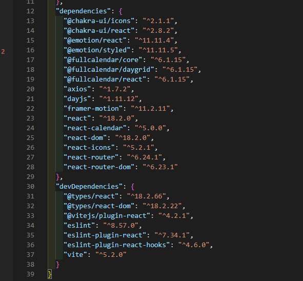
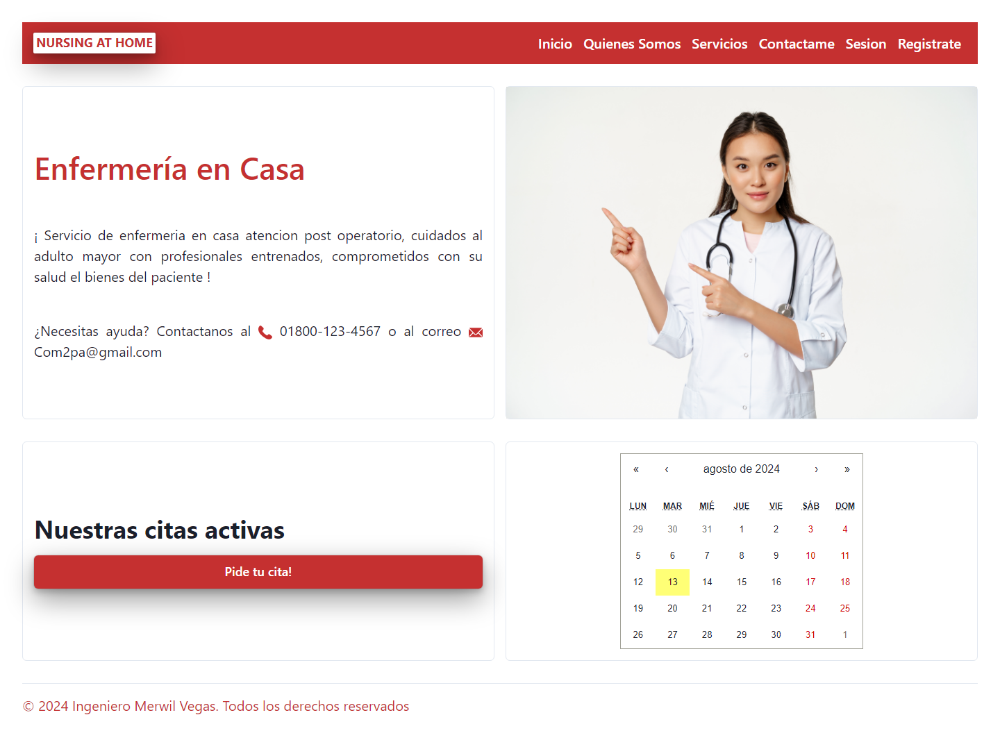
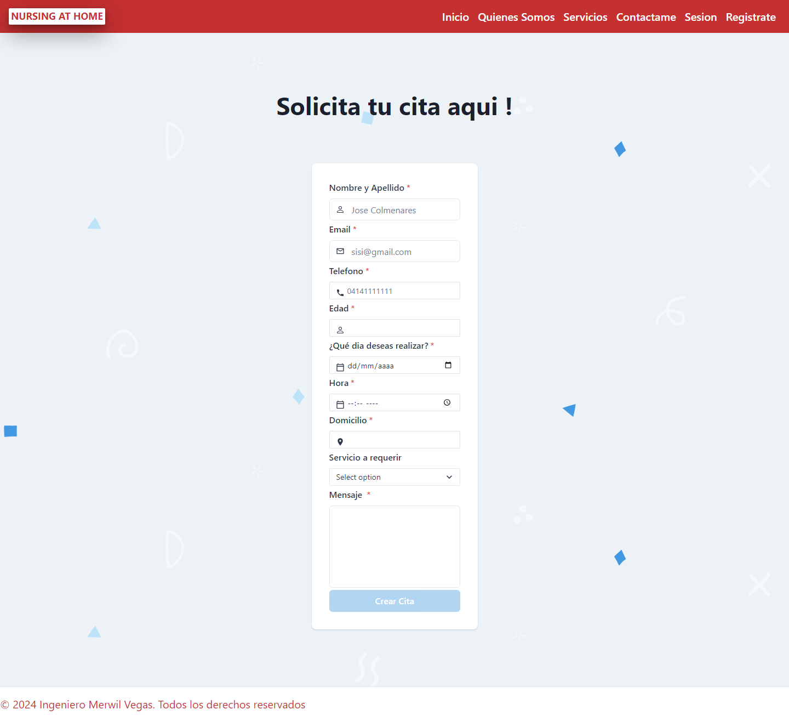
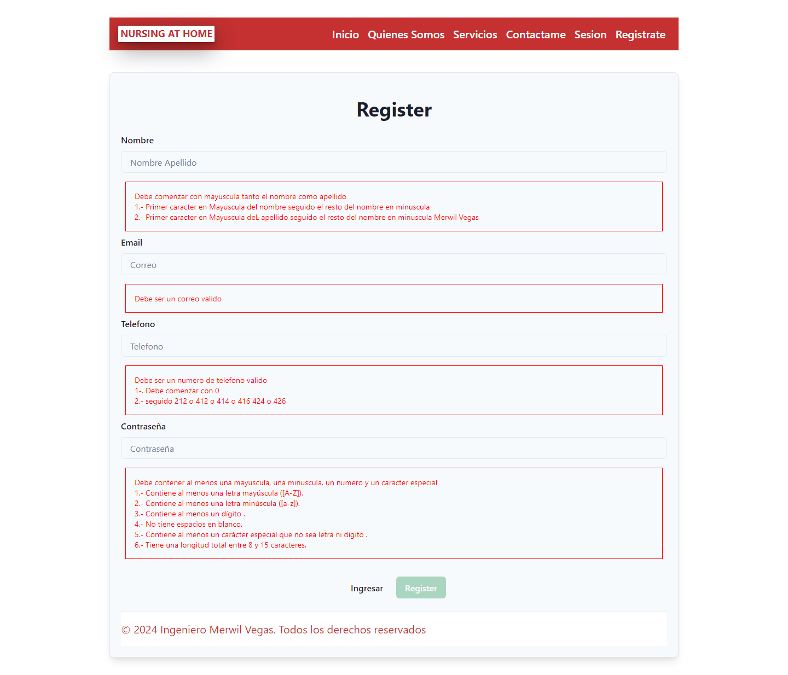
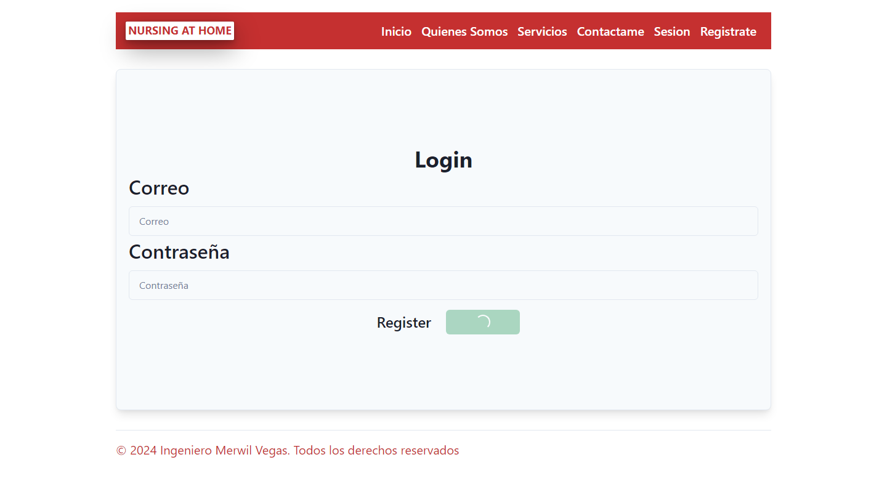

Proyecto NURSING at Home (enfermeria en casa) frontEnd, la cual es desarrollado en react
consiste en:
 1.- Registro e incio de sesion
 2.- ingreso de servicio a ofrecer al paciente
 2.1- crear,editar,eliminar servicio a ofrecer
 3.- ingreso de enfermero
 3.1- crear, editar , eliminar enfermero
 4.- ver citas de paciente
 4.- status de espera , finalizada , detalle de cliente, eliminar citas
 todo con sus repectivas validaciones  y roles 

--pasos para su instalación 
# React + Vite

1-. React +Vite 
1.  instalacion: npm create vite@lastest

seguir los paso de instalacion : 

lenguaje a seleccionar 

una vez terminado la instalacion  realizar lo siguientes

EJERCUTAR EL PROYECTO :
npm run dev

2. instalar la siguiente dependencias

una vez realizado los pasos mencionar y ejecutado el proyecto obtendras el siguiente resultado

!

vista

